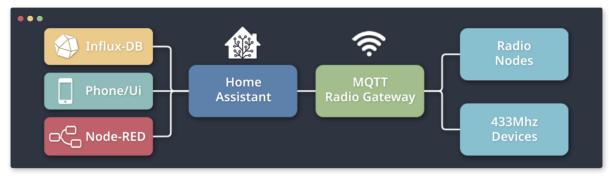
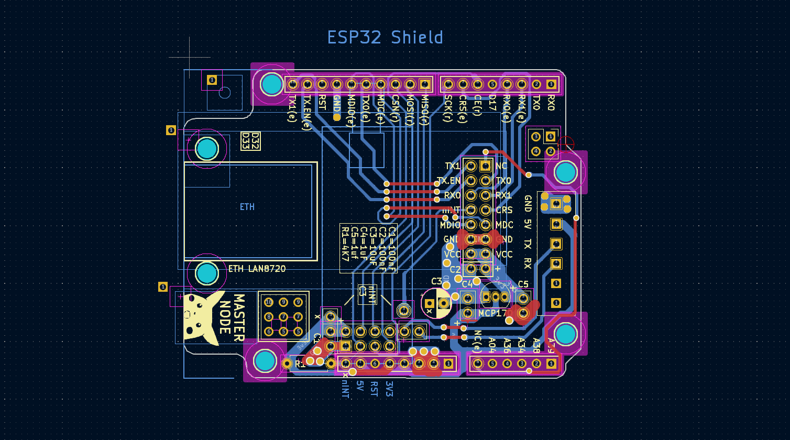

    <h1>
        MQTT-radio-gateway      
    </h1>   

A MQTT gateway for [radio-nodes](https://github.com/Peppson/radio-nodes) (or any other *NRF24L01*-based project) and generic 433Mhz radio devices,  
such as power sockets, lights, etc.  
Written for the ESP32 microcontroller using PlatformIO.

&nbsp; 
## Project Overview
- Primarily made for personal "needs" and as a learning experience.   
- Serves as the central hub for [radio-nodes](https://github.com/Peppson/radio-nodes).
- Takes in MQTT and sends the data via 2.4Ghz radio to the appropriate node,  
maybe to turn on the coffeemaker, water plants, open blinds etc.
- Relays sensor data from nodes to InfluxDB.

&nbsp; 
## PCB - ESP32 Shield
Made a custom PCB to fit ontop of an ESP32 Uno development board.   
Integrates a *LAN8720* ethernet module, a *NRF24L01* radio transceiver and some extra I/O in a compact format.    

KiCad PCB files can be found here: 
[📂 _KiCad/](./_KiCad)  
More images in: 
[📂 _images/](./_images/)   

&nbsp;
   

&nbsp;
### Finished hardware:

